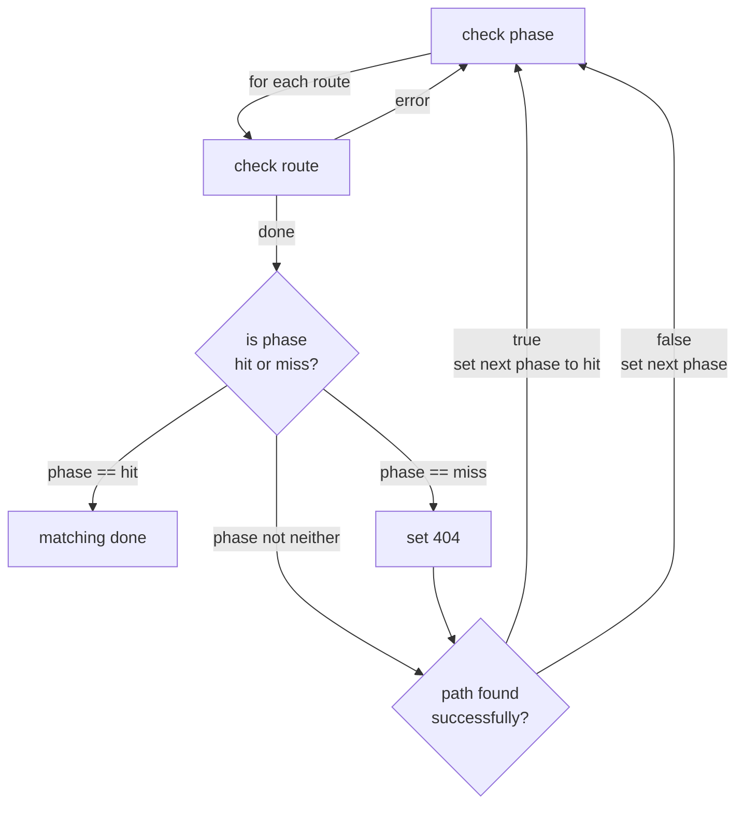
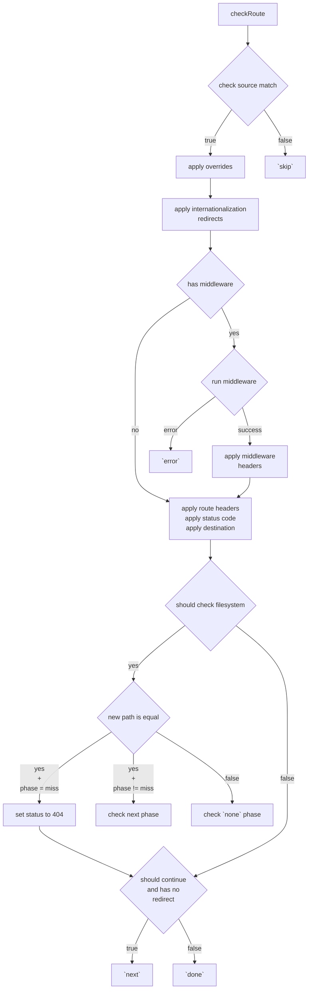
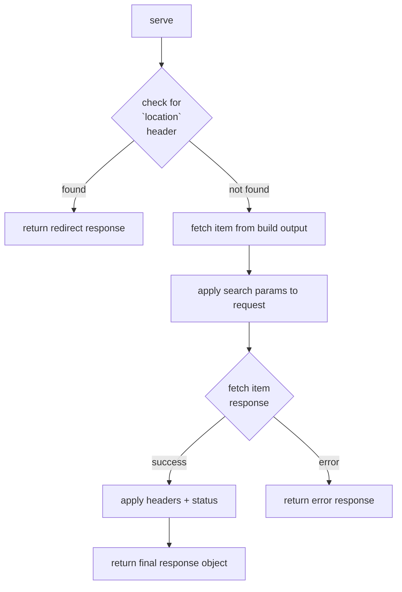

# Routing

To serve incoming requests for a Next.js application deployed on Cloudflare Pages, a worker needs to be able to accurately point the request to the correct route. Routes in a Next.js app can be built as either be functions that need to be ran on the server, or static files that can just be served. In both cases, there are a series of steps that have to be taken to determine the correct destination.

When building an application, the Vercel CLI takes a project and generates a configuration file that defines how the application should be served. This configuration file is useful in determining what happens at each stage of the routing process.

To offer the best support for Next.js applications, the worker needs to try and replicate the routing process that Vercel uses.

## Routing Phases

In order to explain how routing works, it is important to first understand the underlying stages that the system goes through. These are taken from the Vercel build output config (as per the [Vercel documentation](https://vercel.com/docs/build-output-api/v3/configuration#handler-route)), and interpreted in a way that can be used by the worker.

The routing process is broken down into a series of different phases.

- `none` (no phase specified)
- `filesystem`
- `rewrite`
- `resource`
- `miss`
- `error`
- `hit`

Each phase is processed in a somewhat sequential order, depending on the outcome of the previous phase. At different points, certain configuration options are applied, the final destination may be updated, or the final response object is modified.

After checking the [source routes](https://vercel.com/docs/build-output-api/v3/configuration#source-route) for each phase, the system will check the build output to determine if the file path exists or not. If it can find a record for the path, it runs the `hit` phase and then breaks out of the routing system to return a response to the client. If an error occurs during routing (e.g. with middleware), we enter the `error` phase to check for a relevant error page.

### `none`

At the start of the routing process, there is typically a series of source routes that are intended to be processed before any others. There is no phase specified for these routes, so the name `none` has been adopted for them. This is so that they can be grouped up and referenced like the other phases.

During this phase, a number of events may happen. Some of the Next.js features that it handles are as follows.

- `next.config.js`
  - Applying [`headers`](https://nextjs.org/docs/pages/api-reference/next-config-js/headers).
  - Applying [`redirects`](https://nextjs.org/docs/pages/api-reference/next-config-js/redirects).
  - Applying `beforeFiles` [`rewrites`](https://nextjs.org/docs/pages/api-reference/next-config-js/rewrites).
- Middleware functions.
- Rewriting to `RSC` pages for `RSC` requests.

When checking that routes exist in the build output, it only looks for static assets and non-dynamic routes.

### `filesystem`

If a file is not found in the build output at the start of routing (after the `none` phase), the system enters the `filesystem` phase. Here, it will handle another Next.js feature.

- `next.config.js`
  - Applying `afterFiles` [`rewrites`](https://nextjs.org/docs/pages/api-reference/next-config-js/rewrites).

The only routes checked in the build output with this phase are those that result from `afterFiles` `rewrites`.

### `rewrite`

After the `filesystem` phase, we will have checked all possible non-dynamic routes. If a match still hasn't been found, we enter the `rewrite` phase. This is where we use regular expressions to find a match for dynamic routes - the Vercel build output config specifies source routes that turn a path into a file name with search parameters.

For example, the following source route would turn the path `/blog/hello-world` into `/blog/[slug]?slug=hello-world`. From this, we can use `/blog/[slug]` to locate the function in the build output.

```json
{
	"src": "^/blog/(?<slug>[^/]+?)(?:/)?$",
	"dest": "/blog/[slug]?slug=$slug"
}
```

After the rewrites have occurred, the build output is checked for matches with dynamic routes.

### `resource`

This could be considered the penultimate stage in the routing system, as it is the final point for mapping an incoming request to a valid route, before declaring it as a miss.

The `resource` phase handles any remaining user-specified rewrites, and then checks the build output for any remaining routes. Further, it sets the status to 404 for any other routes that have not had a match yet.

- `next.config.js`
  - Applying `fallback` [`rewrites`](https://nextjs.org/docs/pages/api-reference/next-config-js/rewrites).

### `miss`

At this point, we have checked all possible routes, and none of them have matched. This ultimately means that the path could not be found in the build output at any point, and so we need to return a 404 response to the client.

### `error`

The error phase is a rather interesting one in that it appears to need completely custom behaviour to function properly. It defines a list of source routes with status codes, usually to map a request to a custom error page.

The unusual part, however, is that there is no clear way to differentiate between which should be matched, without changing the default behaviour. Instead of treating the status code property as something to be applied to the response, instead we have to treat it as something that we are trying to match with.

### `hit`

At the end of matching, we finally enter the `hit` phase. Here, additional headers are applied, such as the `x-matched-path` header. We enter this phase regardless of if the match ultimately resulted in a miss or not.

Normally, when a match results in a miss, it will use a page at `/404` to handle the response. This would still need to have the relevant headers applied from _hitting_ a file.

## Routing Process

Now that we have a better understanding of the different phases, we can look at how the routing process works as a whole. The actual system that was designed to handle this is a little complex, but it can be broken down into a series of steps.

Along the way, there are several times where custom behaviour has had to be introduced. This is, in part, to maximise the amount of features we support, but also because the routing system used internally by Vercel is not necessarily documented that much. Our system is custom built to serve requests, designed around our understanding of how Vercel's system should function with the Vercel build output.

A simplistic overview of the routing process is as follows.

- Call the handler with the request.
- Check each phase from the build output configuration.
  - Check each source route in a phase to see if it matches.
  - If a match is found, apply any relevant response modifiers.
  - Determine what to do next; return the match, or continue through routing.
- Run the matched function, or fetch the matched static asset.
- Return the final response.

In order to prevent runaway phase checking, i.e. infinitely looping through phases, we have checks that determine whether we have processed phases too many times. This is indicative of records in the build output configuration causing infinite loops, and the counter resets each time the router is run for a request.

### Checking Phases

When we receive a request, the router looks for matches in the different phases, starting at the `none` phase.

For every single source route in a phase, we check to see whether the route is a match, and process the relevant details (for more details on source checking see the [Checking Source Routes section](#checking-source-routes)). When we receive a response from the route checker, if we encountered an error — normally from running middleware — we break out of the routing process and return the error response. Otherwise, the only other time we disable the continuation of routing is if the route checker returns a final match.

After all the source routes in the current phase have been checked, we move on to determine what will happen next. If the current phase is the `hit` phase, or the route has at some point been rewritten to an URL, the routing is complete and we're ready to server the the response.

If the current phase is `miss`, we check the build output, if there is no file matching the requested one we set the status code to 404. Afterwards, if a file was found in the output, or the current phase is `error`, we move on to the `hit` phase. It is important that the `hit` phase is run every time a match is found in the build output or when the current phase is `miss` or `error`, because this allows us to update the headers for the response with the current matched path.

In all other cases, we attempt to retrieve the next phase, based on the current one, and iterate forward.

#### Diagram



### Checking Source Routes

For every source route in a phase, we need to check for a match and process it accordingly.

#### Source Matching

The first step in this part of the process is checking the value for the route matches up with the current path. At the same time, this also extracts any dynamic parameters.

Checking whether a route is a match involves verifying that the request method is the same, the correct fields are or aren't specified, and the current path name matches.

If the route was not a match, we simply skip it (i.e. it doesn't involve the current request).

#### Overrides

In different phases, different things may be applied to our response object, or modify the current requests details. The first thing we check for is whether a (matching) source route wants to override the current headers and status code and, if so, reset them.

#### Locale

To support internationalization redirects, the Vercel build output configuration contains source routes that map locales to redirects for both [sub-path](https://nextjs.org/docs/pages/building-your-application/routing/internationalization#sub-path-routing) and [domain](https://nextjs.org/docs/pages/building-your-application/routing/internationalization#domain-routing) routing. Dealing with these is a little challenging due to the format of some of the records and, as such, has involved custom behaviour.

When we encounter a list of a locale redirects, we have to check for any cookie value that is provided as a way to override the request's `Accept-Language` header. Both the cookie and the header have to be parsed into a form that represents the locales, sorted by [quality](https://developer.mozilla.org/en-US/docs/Web/HTTP/Headers/Accept-Language#directives). Vercel considers the locale in the cookie to take precendence over the header.

If we find a locale that matches the current request, we apply a redirect for it and exit the routing process. At the same time, whenever we encounter a source route with a locale property, we store the list of locales for later use when dealing with edge cases.

The custom behaviour that was referred to above comes into play when processing sub-path locale source routes. The `src` value that is used to match the request appears to only be for `/`, instead of `^/$`. This means that we have to check if the `src` value is a regular expression, and if not, handle it another way, to ensure that we are on the root. This is because automatic locale detection should [only occur at the application's root](https://nextjs.org/docs/pages/building-your-application/routing/internationalization#automatic-locale-detection).

One of the edge cases that we have to deal with when internationalization is enabled is in the `miss` phase. Sometimes, the build output config has a record that rewrites all paths containing `/{locale}` to `/`, instead of `^/{locale}$`. This is an important distinction as it prevents us from reaching the next source route which handles including everything after the locale. Therefore, when checking source routes in the `miss` phase, we have to use the list of locales that we stored earlier to check if the current `src` value is a known locale, and if so, change the matcher to be `^/{locale}$` instead of `/{locale}`.

#### Middleware

Next up, any middleware is run. Middleware occurs during the `none` phase, at the very start of the routing process. The response headers from the middleware and taken and applied to the request and the response object, where appropriate.

Additionally, it is important to check whether the middleware was a rewrite, so that the current path can be updated.

If running the middleware failed, we have to bail out of routing and enter the `error` phase, and then return the error response to the client.

#### Headers and Status Code

Source routes are able to specify headers and status codes to apply to the response. These are updated internally so that they can be applied to the final response object.

There are two different types of headers that the build output config can provide. There are important ones, and normal ones. Whether headers should be treated as important is denoted by the presence of an `important` property on a source route. We believe that this indicated that the headers should take precedence over all others on the final response object.

#### Destination

If a source route wants to rewrite the current path to point to a different file, it specifies a destination property. We take such destination from (matching) source routes and replace the current path with them, along with applying any search parameters we might have collected.

This is where a route's dynamic parameters are applied as search parameters.

When updating the current path to the new destination, additional custom interpretations are needed to ensure compatibility with `RSC` pages. Sometimes, the build output might not generate an `RSC` page, and to avoid breaking routing, we instead want to rewrite the path and return the non-`RSC` page.

In other cases, the build output config may be trying to rewrite a path from `^/` to `/index.rsc`, when the path has additional characters after the `/`. This appears to be a misjudgement in when to apply this rewrite. To ensure that only index pages are affected by this rewrite, we check that the rewritten path is replacing an index path.

#### Checking the New Destination

Sometimes, a route may rewrite a path and require that its existence is verified in the file system before continuing. On the Vercel [documentation](https://vercel.com/docs/build-output-api/v3/configuration#source-route), it states that the `check` property should trigger entering the `filesystem` and `rewrite` phases.

This can be somewhat problematic.

Requests that should be interpreted as requesting the `RSC` version of a page need to enter the `none` phase to receive a rewrite to the `RSC` path. However, if we assume that `check` should take us back to `filesytem`, instead of the routes that aren't in a phase, we would end up not supporting `RSC` pages properly.

Therefore, when the rewritten path has changed and we are not in the `miss` phase, we send the request back to the `none` phase, so that it can be processed from the start.

In the event that the rewritten path is the same as the current path, we opt to send the request to the next phase when the current phase is not `miss`. This custom check for the `miss` phase is necessary in order to prevent infite loops for requests to `/_next/static/...`, and `/_next/data/...`, as they may be rewritten to themselves when calling `check`. As such, if we are in the `miss` phase, we instead update the status code to 404.

If the rewritten path was not equal to the current path but the current phase is `miss`, we instead send the request to the `filesystem` phase if the path does not exist in the build output. If it does exist, we just reset the status code if it was previously 404. This is to deal with the case where a rewrite in the `none` phase contrasts with one in the `miss` phase, e.g. with internationalization (i18n).

#### Continuing with the Routing Process

After all of the above has been completed, the final part to check for a (matching) route is whether it would like us to continue matching (it does so by setting its `continue` field to `true`). If it does not, we have reached the end of matching for this phase.

#### Diagram



### Serving Responses

After the routing process has reached the end and found a match, the final thing to do is serve the response. First, it is necessary to determine whether a redirect should occur, based on the location header, so that it can be returned before running a function or fetching a static asset.

If a redirect should occur, we simply return the redirect response.

Otherwise, we fetch the record from the build output for the matched path. If we failed to find a record, it results in a 404 response. With the record, we can then run any functions, or fetch any static assets, depending on the type. Before running the function, the final search parameters are applied to the request object.

After the response object has been created, we apply any headers and status codes that were specified by the source routes.

Finally, we return the response.

#### Diagram


