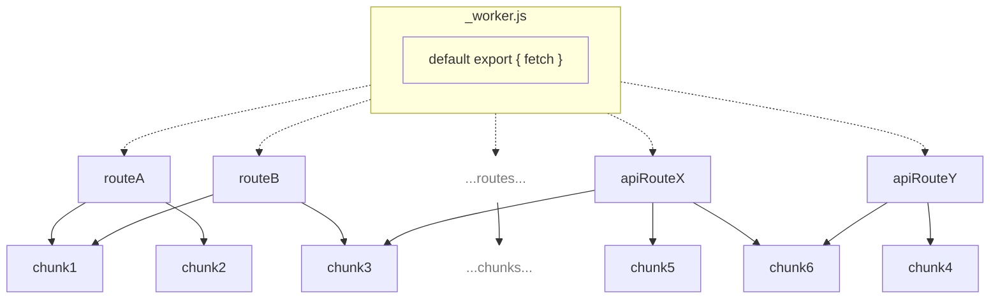

## Lazy Loading

`@cloudflare/next-on-pages` implements a lazy loading strategy which allows only the necessary javascript code to be evaluated and run when handling a request.

The CLI builds a Next.js application by running the Vercel build command, afterwards it extrapolates the built code in essentially two different kind of javascript files:

- **route files**\
   files each exporting a function that we run to produce a route result for the current request (i.e. based on a request they produce a server side rendered page or the result from an api route)
- **chunk files**\
   files containing code that is shared among different route files, this is done as part of our chunks deduplication strategy which allows us to remove unnecessary code duplication present in the Vercel build output (thus reducing the application's overall javascript code size)

The worker we generate for the Pages project then contains custom logic which is used to map a request to one of the route files (or some static asset file but that's out of scope here).

Such route file statically imports the chunk files it needs, and is in turn dynamically imported by the worker only when the route code is needed to handle the current request, making sure that such code is evaluated and run only when necessary.

The following diagram illustrates the process:

> **Note**
> Arrows indicate imports (_an arrow from `A` to `B` indicate that `A` imports `B`_), dotted arrows indicate dynamic imports (`import()`) while solid arrows indicate static imports (`import * from`).

> **Note**
> The strategy also applies if you disable chunk deduplication (which anyhow is likely useful only for local development and debugging purposes), in such case there won't be any chunk file and the now much bigger route files will still get dynamically imported by the worker.
