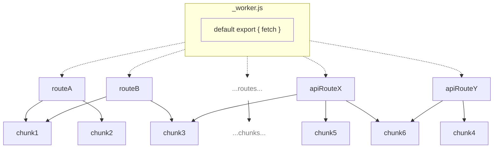

## Lazy Loading

`@cloudflare/next-on-pages` implements a lazy loading strategy which allows only the necessary JavaScript code to be evaluated and run when handling a request.

The CLI builds a Next.js application by running the `vercel build` command and then it sorts the output into essentially two categories of JavaScript files:

- **Route files**\
   Files each exporting a function that we run to produce a route result for the current request (i.e. based on a request they produce a server side rendered page or the result from an api route)
- **Chunk files**\
   Files containing code that is shared among different route files, this is done as part of our chunk deduplication strategy which allows us to remove any unnecessary copies of identical code present in `vercel build`'s output. This reduces the application's overall JavaScript code size.

The Worker we generate for the Pages project then contains custom logic which is used to map a request to one of the route files (or to a static asset when relevant).

The Worker only imports the route code when the route code is needed to handle the current request, and the route code statically imports the chunk files it needs. This ensures that an application's code is evaluated and run only when necessary.

The following diagram illustrates the process:

> **Note**
> Arrows indicate imports (_an arrow from `A` to `B` indicate that `A` imports `B`_), dotted arrows indicate dynamic imports (`import()`) while solid arrows indicate static imports (`import * from`).

> **Note**
> The strategy also applies if you disable chunk deduplication (which anyhow is likely useful only for local development and debugging purposes), in such case there won't be any chunk file and the now much bigger route files will still get dynamically imported by the Worker.
